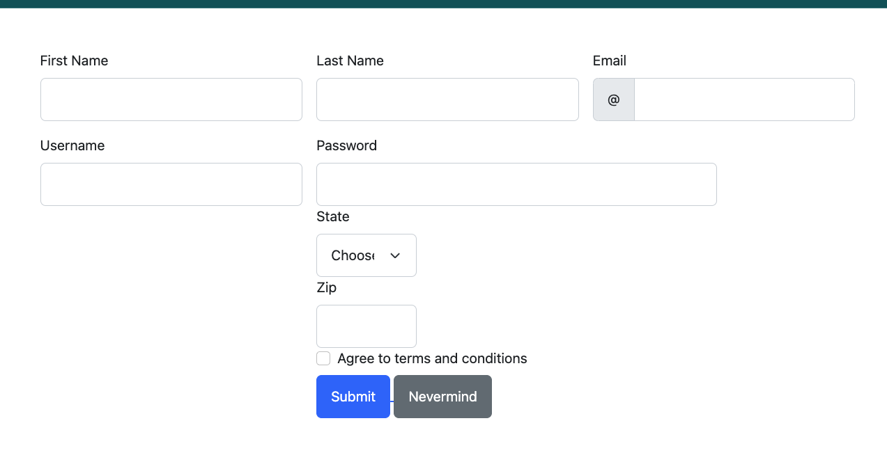
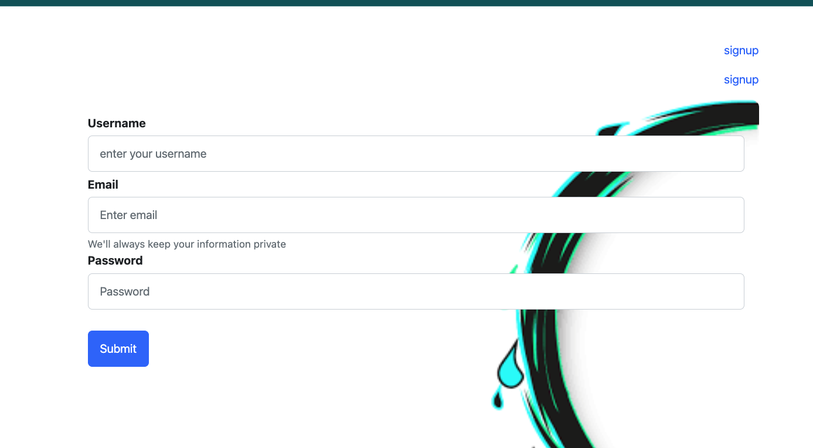
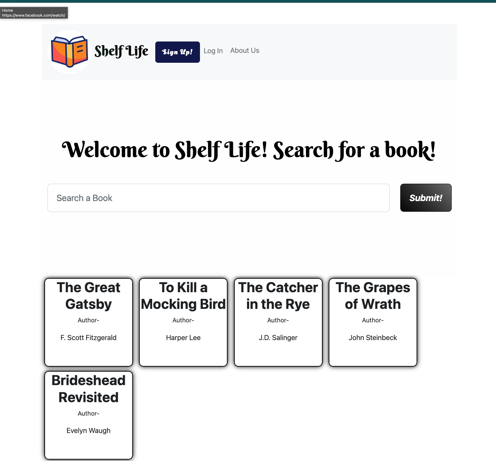

# Shelf Life

## Table of Contents
- [Features](#features)
- [Installation](#installation)
- [Usage](#usage)
- [Contributing](#contributing)
- [Credits](#credits)
- [License](#license)

## Features

- **User Authentication**: Secure login and signup processes.
- **Book Posts**: Users can post about their favorite books.
- **Comments**: Users can comment on posts to engage in discussions.
- **Dashboard**: A personalized user dashboard showing posts and interactions.
- **Responsive Design**: The application is fully responsive and can be used on a variety of devices.

## Installation

To get started with Shelf Life, follow these steps:

1. **Clone the Repository**
   ```
   git clone https://github.com/MaslowMae/shelfLife]
   cd shelfLife
   ```

2. **Install Dependencies**
   ```
   npm install
   ```

3. **Set Environment Variables**
   Create a `.env` file in the root directory and add the following:
   ```
   DB_NAME='shelf_life_db'
   DB_USER='your_username'
   DB_PASSWORD='your_password'
   SESSION_SECRET='your_secret'
   ```

4. **Database Setup**
   Ensure that MySQL is running and execute the scripts found in the `db` directory to set up your database.

5. **Seed Database**
   ```
   node seeds/seed
   ```

6. **Start the Server**
   ```
   npm start
   ```

## Usage

After installing and starting the server, navigate to `http://localhost:3000` to access Shelf Life. Here’s how you can use the application:

### Creating an Account
- **Sign Up**: Go to the signup page from the homepage and enter your details to create a new account.
- **Log In**: If you already have an account, click on the login link and enter your credentials to access your dashboard.




### Interacting with Posts
- **Search Posts**: Search for posts on specific books through the prominant search bar on the home page.  



- **Create a Post**: Click on a book to share your thoughts. You'll be prompted to enter the book title, author, and your comments.

### Engaging with Other Users
- **Comment on Posts**: Under each post, there's an option to add a comment, allowing you to engage with other readers.

Use these features to fully engage with the Shelf Life community, discover new books, and share your reading experiences.


## Contributing

Contributions to Shelf Life are welcome! Here are some ways you can contribute:

- Reporting bugs
- Suggesting enhancements
- Submitting pull requests with improvements to code or documentation

Please ensure to follow the project's code of conduct and contribution guidelines.

## Credits

Shelf Life relies on the following dependencies:

- [Auth](https://www.npmjs.com/package/auth)
- [Axios](https://axios-http.com/)
- [Bcrypt](https://www.npmjs.com/package/bcrypt)
- [Connect Session Sequelize](https://www.npmjs.com/package/connect-session-sequelize)
- [Dotenv](https://www.npmjs.com/package/dotenv)
- [Express](https://expressjs.com/)
- [Express Handlebars](https://www.npmjs.com/package/express-handlebars)
- [Express Session](https://www.npmjs.com/package/express-session)
- [Handlebars](https://handlebarsjs.com/)
- [Inquire](https://www.npmjs.com/package/inquire)
- [MySQL2](https://www.npmjs.com/package/mysql2)
- [Sequelize](https://sequelize.org/)

## License


